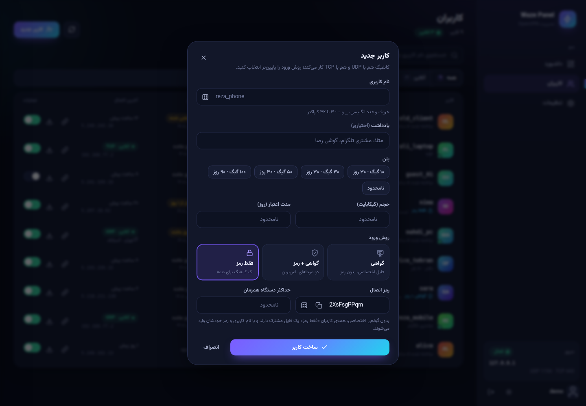
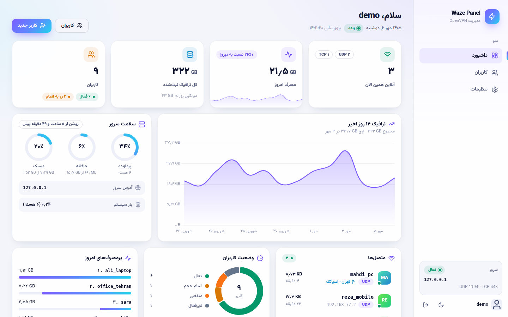
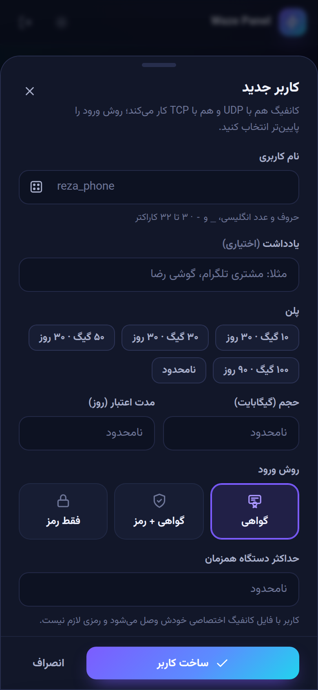

# ⚡ Waze Panel

پنل مدیریت OpenVPN با نصب یک‌دستوری، داشبورد زنده، کاربران با پروتکل **UDP و TCP همزمان**،
لینک اشتراک اختصاصی و کنترل لحظه‌ای حجم و انقضا — روی هسته‌ی اصلی OpenVPN.

<p>
  
  
  
  
</p>

<p align="center">
  
</p>

---

## ✨ امکانات

**تانل ایران (سرور واسط)** ⭐
- یک سرور داخل ایران را با **یک دستور** سرور واسط کنید؛ کاربران به آی‌پی ایران وصل می‌شوند و ترافیک در سطح کرنل (iptables) به سرور خارج می‌رسد — در اختلال‌ها و «اینترنت ملی» پایداری خیلی بالاتر.
- چند سرور واسط با **اولویت‌بندی و failover خودکار**: کانفیگ‌ها سرورها را به ترتیب امتحان می‌کنند و اگر یکی جواب نداد، چند ثانیه بعد سراغ بعدی (و در آخر اتصال مستقیم) می‌روند.
- **پخش کاربران** بین سرورهای واسط، زمان failover قابل تنظیم، خاموش/روشن کردن هر سرور.
- **بررسی سلامت واقعی مسیر** هر ۳ دقیقه (نه فقط باز بودن پورت) با نمایش تاخیر در داشبورد، و نام سرور واسط کنار هر اتصالی که از آن آمده.

**ورود با یوزر و پسورد (اختیاری، برای هر کاربر)**
- سه روش ورود: **گواهی** (پیش‌فرض)، **گواهی + رمز** (دو مرحله‌ای) و **فقط رمز** با یک **کانفیگ مشترک** برای همه — مثل پنل‌های SSH.
- **محدودیت دستگاه همزمان** برای هر کاربر (اتصال جدیدتر می‌ماند، قدیمی‌تر قطع می‌شود).
- محافظت در برابر حدس رمز، پیام خطای واضح داخل اپ (رمز اشتباه، اتمام حجم، انقضا)، و قطع فوری اتصال با تغییر رمز یا روش ورود.

**سرور و OpenVPN**
- نصب خودکار با یک دستور: OpenVPN و easy-rsa، CA و گواهی سرور، **دو سرویس همزمان** (UDP و TCP)، NAT و فایروال، و پنل به‌صورت سرویس systemd.
- هر کاربر یک **گواهی TLS واقعی** دارد که هم روی UDP و هم TCP کار می‌کند (AES-256-GCM + tls-crypt).
- **کنترل لحظه‌ای**: اتمام حجم، انقضا یا غیرفعال‌سازی، اتصال را **وسط کار** قطع می‌کند (با پیام HALT، تا کلاینت پشت سر هم تلاش نکند).
- حذف کاربر گواهی را **باطل** می‌کند (CRL) — رد شدن در همان مرحله‌ی TLS.
- گواهی‌ها و CRL با اعتبار ۱۰ ساله، به‌همراه امضای مجدد روزانه‌ی CRL.

**پنل**
- داشبورد زنده: آنلاین‌ها با پروتکل و IP، مصرف امروز با مقایسه‌ی دیروز، نمودار ۱۴ روزه با تاریخ شمسی، سلامت سرور (CPU/RAM/دیسک)، وضعیت کاربران، پرمصرف‌های امروز و لیست **نیاز به تمدید** با تمدید یک‌کلیکی.
- مدیریت کاربران با فیلتر (آنلاین، رو به اتمام، منقضی، …)، جستجو، مرتب‌سازی و کشوی جزئیات: حلقه‌ی مصرف، نمودار مصرف هر کاربر، **تمدید سریع** (+۳۰ روز، +۱۰ گیگ، …)، لینک اشتراک با QR.
- ساخت کاربر با پلن‌های آماده و صفحه‌ی «آماده است» برای اشتراک‌گذاری فوری لینک و QR.
- تم تاریک و روشن، فارسی کامل با اعداد فارسی و تاریخ شمسی.
- **موبایل مثل یک اپ واقعی**: ناوبری پایین با دکمه‌ی + وسط، تب «آنلاین» با شمارنده‌ی زنده، جزئیات کاربر و فرم‌ها به‌صورت **Bottom Sheet** با کشیدن به پایین برای بستن، دکمه‌ی «ارسال» با اشتراک‌گذاری خود گوشی (تلگرام، واتس‌اپ…)، لرزش کوتاه هنگام لمس، و **نصب پنل روی صفحه‌ی اصلی گوشی** (PWA).
- **بدون وابستگی به CDN**: فونت و کتابخانه‌ها روی خود سرور هستند؛ در شبکه‌هایی که CDNها فیلتر یا کند هستند هم کامل کار می‌کند.
- پشتیبان‌گیری کامل (دیتابیس + تنظیمات + CA) از داخل پنل.

**لینک اشتراک (برای کاربر نهایی)**
- بدون لاگین: درصد مصرف، باقیمانده، روزهای اعتبار و دانلود کانفیگ UDP/TCP — **بدون نمایش پورت‌ها** به کاربر.
- برای کاربران رمزدار: کارت «مشخصات ورود» با کپی و نمایش رمز؛ صفحه قابل نصب به‌صورت برنامه روی گوشی کاربر.
- راهنمای اتصال مخصوص اندروید، آیفون، ویندوز و مک (تشخیص خودکار دستگاه).
- QR برای باز کردن همان صفحه روی دستگاه دیگر.

## 📸 تصاویر

| | |
|---|---|
|  |  |
|  |  |

<p align="center"></p>

<p align="center">
  
  
  
  
</p>

## 🚀 نصب

روی سرور **Ubuntu 22.04 / 24.04** یا **Debian 12** با کاربر root فقط همین یک خط:

```bash
bash <(curl -Ls https://raw.githubusercontent.com/Metixpro/waze-panel/main/install.sh)
```

نصب‌کننده آی‌پی سرور را خودش پیدا می‌کند، پورت‌های آزاد را انتخاب می‌کند و یک خلاصه نشان می‌دهد:
**Enter** = شروع نصب، **c** = تغییر تنظیمات (آدرس، یوزرنیم ادمین، دامنه و SSL، پورت‌ها). در پایان آدرس پنل و رمز ادمین نمایش داده می‌شود.

- با sudo (کاربر غیر root): `sudo bash -c "$(curl -fsSL https://raw.githubusercontent.com/Metixpro/waze-panel/main/install.sh)"` — حالت `sudo bash <(...)` کار نمی‌کند چون sudo آن ورودی را می‌بندد.
- بدون هیچ سؤالی: در انتهای همان دستور ` --yes` بگذارید (مثلا `bash <(curl -Ls …/install.sh) --yes`).
- روی سروری که پنل نصب است، همین دستور = **به‌روزرسانی** (همه‌چیز حفظ می‌شود).

> پنل به Python 3.10 یا جدیدتر نیاز دارد؛ روی Ubuntu 20.04 و Debian 11 نصب‌کننده همان ابتدا با پیام واضح متوقف می‌شود.

| فلگ | توضیح | پیش‌فرض |
|---|---|---|
| `--yes` | بدون سؤال | - |
| `--panel-port PORT` | پورت پنل | `8000` |
| `--udp-port PORT` | پورت OpenVPN روی UDP | `1194` |
| `--tcp-port PORT` | پورت OpenVPN روی TCP | `443` (یا `8443` با دامنه) |
| `--admin-user NAME` | یوزرنیم ادمین | `admin` |
| `--admin-pass PASS` | رمز ادمین | تصادفی (در به‌روزرسانی بدون تغییر) |
| `--server-address ADDR` | آی‌پی/دامنه‌ی داخل کانفیگ‌ها | تشخیص خودکار |
| `--domain example.com` | Nginx + HTTPS رایگان (Let's Encrypt) برای پنل | - |
| `--no-nginx` | هرگز Nginx نصب نشود | - |

## 🇮🇷 سرور واسط ایران (تانل)

۱. در پنل: **تنظیمات ← سرور واسط ایران ← افزودن سرور** (نام و آی‌پی سرور ایران).
۲. پنل یک دستور آماده می‌دهد؛ آن را روی **سرور ایران** با root اجرا کنید، مثلا:

```bash
bash <(curl -Ls https://raw.githubusercontent.com/Metixpro/waze-panel/main/relay.sh) --to 1.2.3.4 --udp 1194:1194 --tcp 443:443
```

اگر سرور ایران به گیت‌هاب دسترسی نداشت، همان اسکریپت از خود پنل هم قابل دریافت است (`http(s)://پنل/relay.sh`؛ پنل دستورش را نشان می‌دهد).

۳. در پنل «بررسی اتصال» را بزنید؛ کاربران کانفیگ را دوباره از لینک اشتراک بگیرند.

- فوروارد UDP و TCP در کرنل (DNAT) انجام می‌شود، بدون پراکسی و سربار اضافه؛ بعد از ریبوت هم خودکار برقرار است.
- روی سرور ایران: `waze-relay status` (ترافیک و اتصال‌ها)، `waze-relay test` (تست مسیر تا سرور خارج)، `waze-relay restart`، `waze-relay uninstall`.
- «آدرس سرور» در تنظیمات همچنان آدرس سرور **خارج** می‌ماند؛ اتصال مستقیم به آن، آخرین گزینه‌ی پشتیبان در کانفیگ‌هاست (قابل خاموش کردن).

## 🧰 مدیریت از ترمینال

بعد از نصب، دستور `waze-panel` روی سرور در دسترس است:

```bash
waze-panel                   # منوی تعاملی
waze-panel status            # وضعیت سرویس‌ها، تعداد کاربران، اعتبار CRL
waze-panel restart
waze-panel logs [panel|udp|tcp]
waze-panel reset-password    # فراموشی رمز ادمین
waze-panel backup [dir]      # پشتیبان کامل (دیتابیس + تنظیمات + CA)
waze-panel restore <file>    # بازگردانی، مثلا روی سرور جدید
waze-panel update            # به‌روزرسانی به آخرین نسخه
waze-panel uninstall
```

**به‌روزرسانی امن است:** اجرای دوباره‌ی `install.sh` (یا `waze-panel update`) پورت‌ها، آدرس، کلیدها، کاربران، گواهی‌ها و رمز ادمین را نگه می‌دارد و فقط کد و سرویس‌ها را تازه می‌کند.

## 🏗️ معماری

```
 مرورگر ادمین / کاربر ──▶ FastAPI (waze-panel.service) ──▶ SQLite
                                   │  management interface (127.0.0.1)
                    ┌──────────────┴──────────────┐
            OpenVPN UDP                      OpenVPN TCP
      (openvpn-server@waze-udp)        (openvpn-server@waze-tcp)
                    │  client-connect / client-disconnect (nobody:nogroup)
                    └──────────────┬──────────────┘
                                   ▼
                 /internal/hooks/*  — فقط loopback + توکن (hook.env)
```

- **مجوز اتصال** در هوک `client-connect` بررسی می‌شود (فعال، منقضی، حجم) و رد شدن در سطح خود OpenVPN است.
- **حسابداری مصرف** از دو مسیر: خواندن دوره‌ای رابط مدیریتی (برای اتصال‌های طولانی و قطع آنی) و هوک `client-disconnect` (برای دقت نهایی هر سشن)، با قفل و شناسه‌ی سشن تا چیزی دوبار شمرده نشود.
- هوک‌ها بعد از افت دسترسی OpenVPN با کاربر `nobody` اجرا می‌شوند؛ به همین دلیل فایل جداگانه‌ی `hook.env` (فقط پورت و توکن، `root:nogroup 0640`) دارند.

## 🔐 امنیت

- ورود ادمین با محافظت در برابر حدس رمز (۵ تلاش ناموفق = ۱۰ دقیقه مسدودی برای آن IP).
- با `--domain` پنل فقط روی `127.0.0.1` گوش می‌دهد و از طریق Nginx + HTTPS در دسترس است؛ بدون دامنه، پنل روی HTTP است — حتما رمز قوی بگذارید.
- API داخلی هوک‌ها فقط به درخواست مستقیم از loopback جواب می‌دهد و در Nginx هم بسته است.
- دیتابیس و `panel.env` فقط برای root قابل خواندن‌اند (`0600`).
- لینک اشتراک بدون لاگین باز می‌شود؛ اگر لو رفت، از «لینک جدید» در جزئیات کاربر استفاده کنید.
- ورود با رمز هرگز اجازه نمی‌دهد یک گواهی خودش را جای کاربر دیگری جا بزند (`username-as-common-name` عمدا استفاده نشده)؛ تلاش‌های ناموفق برای هر نام کاربری/آی‌پی محدود می‌شوند. رمز کاربران VPN برای نمایش دوباره به ادمین در دیتابیس (فقط root) نگه داشته می‌شود.

## 🧪 تست

`tests/e2e.sh` روی یک نصب واقعی، کلاینت واقعی OpenVPN را از یک network namespace جدا وصل می‌کند و ۵۶ مورد را بررسی می‌کند: اتصال UDP/TCP، حسابداری ترافیک بدون شمارش دوباره، هر سه روش ورود (رمز اشتباه، جعل هویت با گواهی دیگران، کانفیگ مشترک)، محدودیت دستگاه، **عبور از سرور واسط واقعی** (اسکریپت relay.sh در namespace جدا) و failover به اتصال مستقیم، قطع وسط اتصال با اتمام حجم، باطل شدن گواهی و اعتبار CRL.

```bash
sudo bash tests/e2e.sh          # KEEP=1 برای نگه داشتن لاگ‌ها
```

## 📂 ساختار پروژه

```
app/
  main.py  config.py  models.py  cli.py  backup.py  relays.py  pwa.py
  openvpn/   certs.py (easy-rsa) · templates.py (.ovpn) · mgmt.py · scheduler.py
  routers/   auth · dashboard · users · subscription · internal · settings · relays
  templates/ صفحات Jinja2 (RTL)       static/  css · js · vendor (فونت و کتابخانه‌های محلی)
scripts/     هوک‌های OpenVPN · قالب کانفیگ‌ها و systemd · waze-panel-cli.sh
tests/e2e.sh
install.sh · uninstall.sh · relay.sh (سرور واسط)
```

## 🛠️ توسعه محلی

```bash
python3 -m venv venv && . venv/bin/activate && pip install -r requirements.txt
export DATA_DIR=$PWD/.devdata DB_PATH=$PWD/.devdata/dev.db && mkdir -p .devdata
python -m app.cli create-admin --username admin --password admin1234
uvicorn app.main:app --reload
```

ساخت گواهی و آمار زنده به OpenVPN و easy-rsa نیاز دارند؛ برای تست کامل از `tests/e2e.sh` روی یک سرور استفاده کنید.

## 🗑️ حذف

```bash
sudo waze-panel uninstall        # یا: sudo bash /opt/waze-panel/uninstall.sh --purge
```

## 📄 مجوز

MIT — [LICENSE](./LICENSE). فونت وزیرمتن تحت SIL OFL و کتابخانه‌های داخل `app/static/vendor` تحت MIT هستند ([جزئیات](app/static/vendor/LICENSES.md)).
