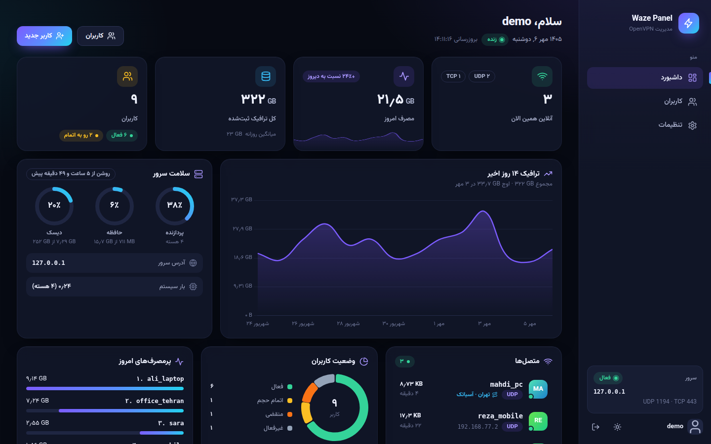
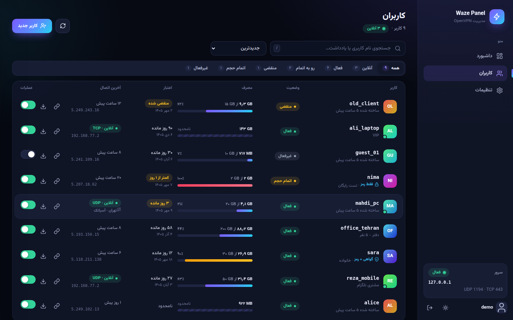
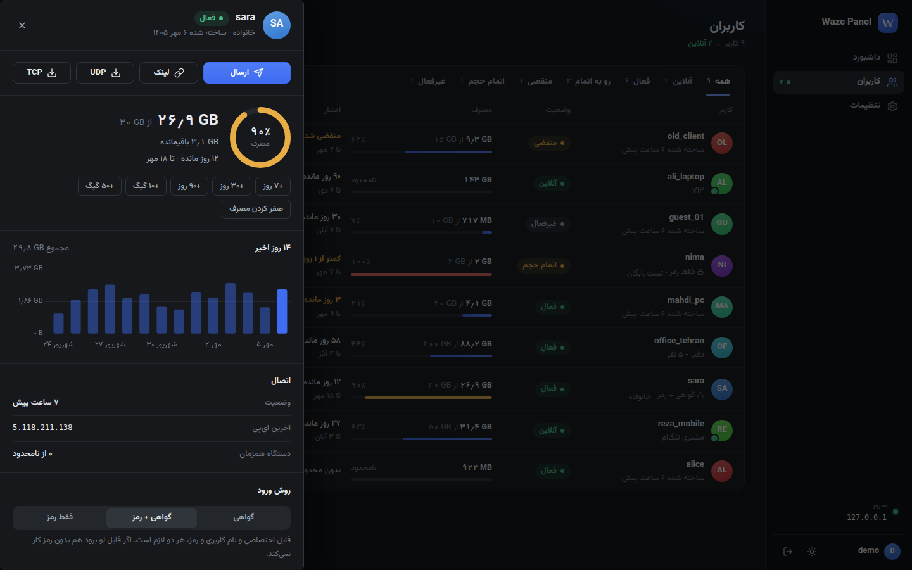
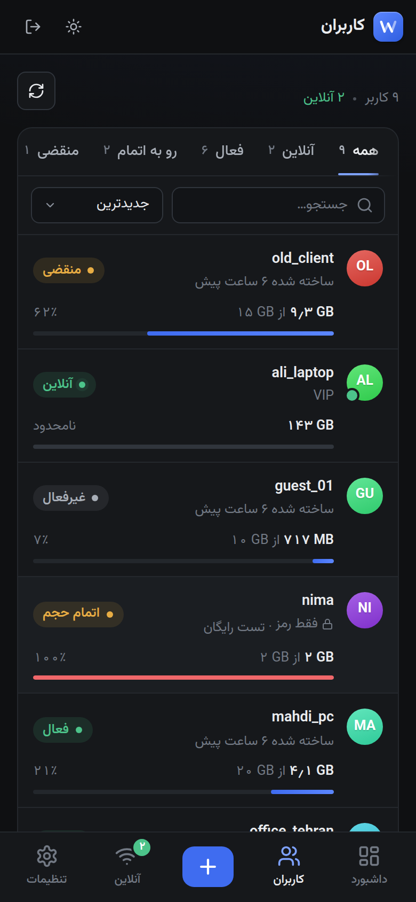
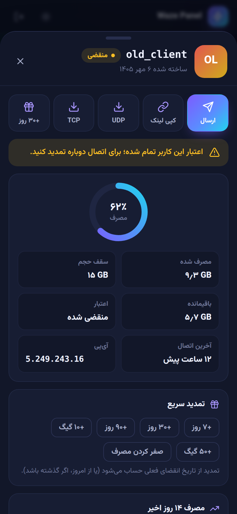
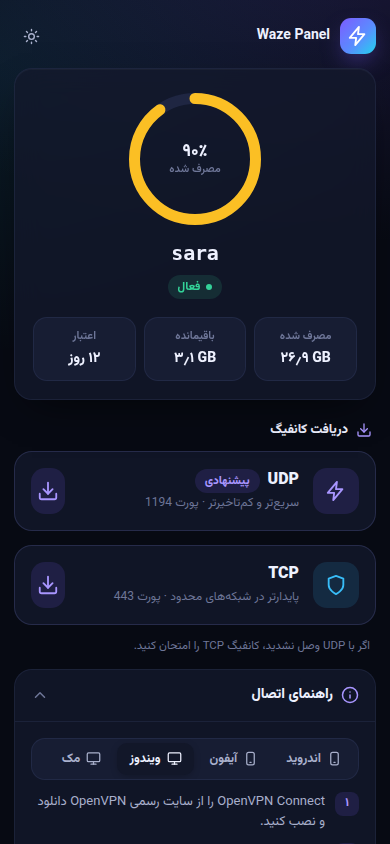
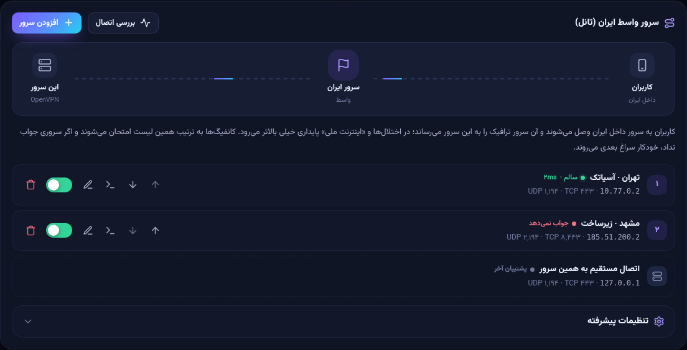
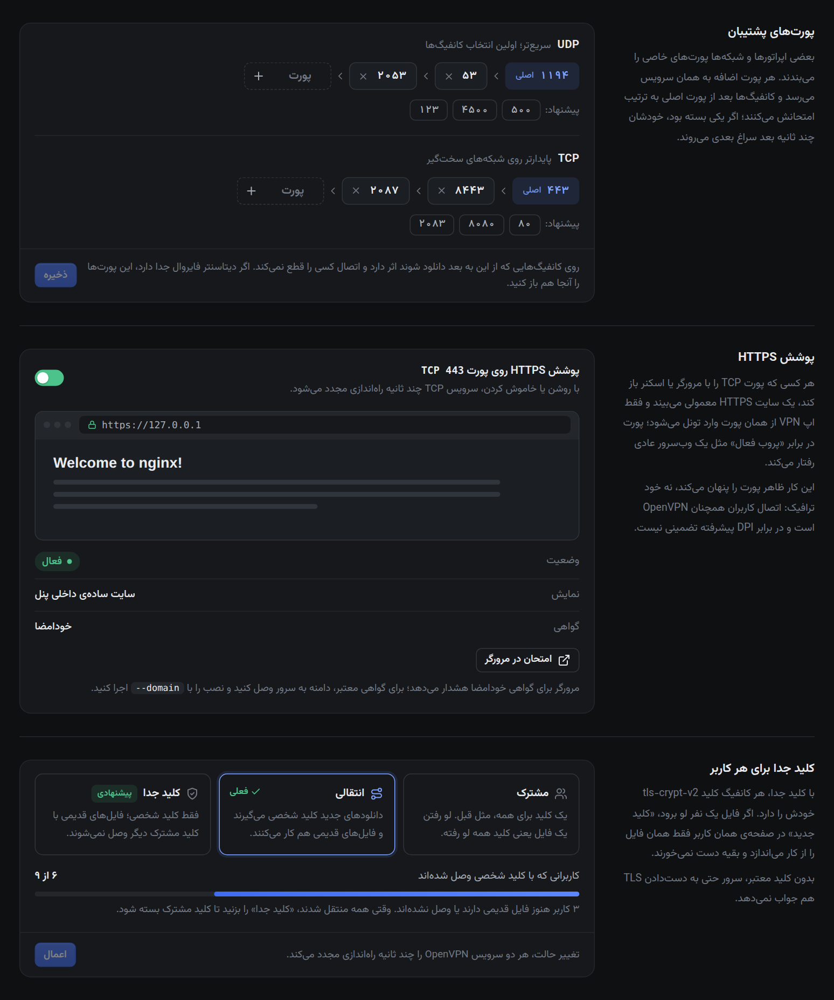

<p align="center">
  
</p>

<h1 align="center">Waze Panel</h1>

<p align="center">پنل مدیریت OpenVPN با رابط فارسی</p>

<p align="center">
  
  
  
</p>

<p align="center">
  
</p>

## این چیست

Waze Panel یک پنل وب برای اداره‌ی سرور OpenVPN است. کاربر می‌سازید، حجم و تاریخ انقضا می‌گذارید، لینک اشتراکش را برایش می‌فرستید و کاربر کانفیگ را از همان لینک برمی‌دارد. زیر پنل خود OpenVPN کار می‌کند؛ پنل گواهی می‌سازد، مصرف را می‌خواند و وقتی حجم یا اعتبار تمام شد اتصال را قطع می‌کند.

دو سرویس OpenVPN هم‌زمان بالا هستند، یکی روی UDP و یکی روی TCP، و هر کاربر با همان یک گواهی روی هر دو وصل می‌شود. رابط پنل فارسی است (راست‌به‌چپ، تاریخ شمسی، اعداد فارسی) و روی گوشی هم راحت کار می‌کند.

روی Ubuntu 22.04 و 24.04 و Debian 12 با یک دستور نصب می‌شود.

## نصب

با کاربر root:

```bash
bash <(curl -Ls https://raw.githubusercontent.com/Metixpro/waze-panel/main/install.sh)
```

نصب‌کننده آی‌پی سرور را پیدا می‌کند، پورت‌های آزاد را انتخاب می‌کند و قبل از شروع یک خلاصه نشان می‌دهد. Enter یعنی شروع، و با `c` می‌توانید آدرس، نام کاربری ادمین، دامنه و پورت‌ها را عوض کنید. آخر کار آدرس پنل و رمز ادمین چاپ می‌شود؛ رمز فقط همین یک بار نمایش داده می‌شود.

- اگر root نیستید: `sudo bash -c "$(curl -fsSL https://raw.githubusercontent.com/Metixpro/waze-panel/main/install.sh)"`. شکل `sudo bash <(...)` کار نمی‌کند، چون sudo ورودی را می‌بندد.
- برای نصب بدون سؤال، آخر دستور `--yes` بگذارید.
- روی سروری که پنل نصب است، همین دستور به‌روزرسانی می‌کند و کاربران، گواهی‌ها و تنظیمات سر جایشان می‌مانند.
- پنل Python 3.10 یا جدیدتر می‌خواهد. روی Ubuntu 20.04 و Debian 11 نصب‌کننده همان اول با یک پیام روشن می‌ایستد.

| فلگ | کار | پیش‌فرض |
|---|---|---|
| `--yes` | بدون سؤال | |
| `--panel-port PORT` | پورت پنل | `8000` |
| `--udp-port PORT` | پورت OpenVPN روی UDP | `1194` |
| `--tcp-port PORT` | پورت OpenVPN روی TCP | `443` (با دامنه: `8443`) |
| `--admin-user NAME` | نام کاربری ادمین | `admin` |
| `--admin-pass PASS` | رمز ادمین | تصادفی؛ در به‌روزرسانی تغییر نمی‌کند |
| `--server-address ADDR` | آی‌پی یا دامنه‌ای که در کانفیگ‌ها می‌رود | خودکار |
| `--domain example.com` | Nginx و HTTPS رایگان (Let's Encrypt) برای پنل | |
| `--no-nginx` | Nginx نصب نشود | |

بدون دامنه پنل روی HTTP بالا می‌آید. اگر می‌شود، دامنه بدهید و رمز ادمین را هم قوی بگذارید.

## چه کارهایی می‌شود کرد

**کاربران**
- ساخت کاربر با حجم، تاریخ انقضا و محدودیت دستگاه هم‌زمان. اگر از حد بگذرد، اتصال جدیدتر می‌ماند و قدیمی‌تر قطع می‌شود.
- سه روش ورود: فقط گواهی (پیش‌فرض)، گواهی و رمز با هم، یا فقط رمز. روش «فقط رمز» یک کانفیگ مشترک بدون گواهی دارد که می‌شود در کانال گذاشت و مشخصات ورود را جدا فرستاد.
- تمام شدن حجم یا انقضا اتصال را وسط کار قطع می‌کند، نه فقط در اتصال بعدی. اپ دلیلش را هم می‌بیند (رمز اشتباه، حجم تمام شده، منقضی).
- حذف کاربر گواهی‌اش را باطل می‌کند و سرور همان مرحله‌ی TLS او را رد می‌کند.

**داشبورد**
- آنلاین‌ها با پروتکل و IP، مصرف امروز، نمودار ۱۴ روز، وضعیت CPU و RAM و دیسک، و فهرست کسانی که به‌زودی تمام می‌شوند تا با یک کلیک تمدیدشان کنید.
- تم تاریک و روشن. فونت و کتابخانه‌ها روی خود سرور هستند و به هیچ CDN‌ای وصل نمی‌شوند، برای شبکه‌هایی که CDN در آن‌ها کند یا فیلتر است.
- روی گوشی مثل یک اپ رفتار می‌کند: منوی پایین، فرم‌ها به‌صورت Bottom Sheet، دکمه‌ی ارسال لینک با اشتراک‌گذاری خود گوشی، و امکان اضافه کردن به صفحه‌ی اصلی.

**لینک اشتراک**
- کاربر بدون لاگین می‌بیند چقدر مصرف کرده، چقدر مانده و تا کی اعتبار دارد، و کانفیگ UDP یا TCP را برمی‌دارد. پورت‌ها را نمی‌بیند.
- راهنمای اتصال برای اندروید، آیفون، ویندوز و مک دارد و QR هم می‌دهد.

**بقیه**
- پشتیبان کامل (دیتابیس، تنظیمات و CA) از داخل پنل.
- صفحه‌ی «درباره» که نسخه، سازنده و تغییرات هر نسخه ([CHANGELOG](CHANGELOG.md)) را نشان می‌دهد و هر ۱۲ ساعت از گیت‌هاب می‌پرسد نسخه‌ی تازه‌ای هست یا نه. فقط شماره‌ی نسخه خوانده می‌شود و می‌شود خاموشش کرد.

<table>
  <tr>
    <td></td>
    <td></td>
  </tr>
</table>

<p align="center">
  
  
  
</p>

## سرور واسط در ایران

وقتی اتصال مستقیم به خارج کند یا قطع است، می‌شود یک سرور داخل ایران را واسط کرد. کاربران به آی‌پی ایران وصل می‌شوند و آن سرور ترافیک را با iptables (DNAT، بدون پراکسی) به سرور خارج می‌رساند.

۱. در پنل بروید به تنظیمات ← سرور واسط ایران ← افزودن، و نام و آی‌پی سرور ایران را بدهید.<br>
۲. پنل یک دستور آماده می‌دهد. آن را روی سرور ایران با root اجرا کنید، چیزی شبیه:

```bash
bash <(curl -Ls https://raw.githubusercontent.com/Metixpro/waze-panel/main/relay.sh) --to 1.2.3.4 --udp 1194:1194 --tcp 443:443
```

اگر سرور ایران به گیت‌هاب دسترسی ندارد، همین اسکریپت از خود پنل هم گرفته می‌شود (`http(s)://پنل/relay.sh`)؛ پنل دستورش را کنار دستور اصلی نشان می‌دهد.

۳. در پنل «بررسی اتصال» را بزنید و به کاربران بگویید کانفیگ را دوباره بگیرند.

چند سرور واسط هم می‌شود گذاشت. کانفیگ‌ها به ترتیب فهرست امتحان می‌کنند و اگر یکی جواب نداد، چند ثانیه بعد می‌روند سراغ بعدی و آخر سر سراغ اتصال مستقیم (که می‌شود خاموشش کرد). «آدرس سرور» در تنظیمات همچنان آدرس سرور خارج می‌ماند. پنل هر ۳ دقیقه کل مسیر را تست می‌کند، نه فقط باز بودن پورت، و کنار هر اتصالی که از واسط آمده اسم آن واسط را می‌نویسد.

روی سرور ایران: `waze-relay status`، `waze-relay test`، `waze-relay restart` و `waze-relay uninstall`.

<p align="center"></p>

## پورت‌های پشتیبان، پوشش HTTPS و کلید هر کاربر

این سه تا در تنظیمات هستند و بدون دست زدن به فایل کار می‌کنند.

<p align="center"></p>

**پورت‌های پشتیبان.** برای UDP و TCP هر کدام تا ۴ پورت اضافه می‌شود که با iptables به همان سرویس می‌رسند. کانفیگ اول پورت اصلی را امتحان می‌کند و اگر شبکه‌ی کاربر آن را بسته بود، حدود ده ثانیه بعد پورت بعدی را. پورتی که برنامه‌ی دیگری روی سرور دارد (مثل SSH یا خود پنل) قبول نمی‌شود. اگر دیتاسنتر فایروال جدا دارد، این پورت‌ها را آنجا هم باز کنید.

**پوشش HTTPS.** اگر روشن باشد، هر کسی پورت TCP را با مرورگر یا اسکنر باز کند یک سایت HTTPS معمولی می‌بیند و فقط اپ VPN وارد تونل می‌شود (با `port-share` خود OpenVPN). اگر با `--domain` نصب کرده باشید همان سایت Nginx با گواهی Let's Encrypt نشان داده می‌شود، وگرنه یک سایت ساده‌ی داخلی با گواهی خودامضا. این فقط ظاهر پورت را در برابر پروب و اسکن عوض می‌کند. خود ترافیک همچنان OpenVPN است و در برابر DPI پیشرفته چیزی را تضمین نمی‌کند.

**کلید جدا برای هر کاربر.** به‌جای یک کلید tls-crypt برای همه، هر کانفیگ کلید tls-crypt-v2 خودش را دارد. اگر فایل یک نفر جایی افتاد، دکمه‌ی «کلید جدید» در صفحه‌ی همان کاربر فقط همان فایل را باطل می‌کند و سرور حتی جواب TLS آن را نمی‌دهد. بقیه دست نمی‌خورند. سه حالت دارد:

| حالت | کانفیگ‌های جدید | کانفیگ‌های قدیمی (کلید مشترک) |
|---|---|---|
| مشترک | کلید مشترک | کار می‌کنند |
| انتقالی | کلید شخصی | کار می‌کنند |
| کلید جدا | کلید شخصی | وصل نمی‌شوند |

همه‌ی نصب‌ها روی «مشترک» شروع می‌کنند و کلید جدا را خودتان روشن می‌کنید، چون بعضی اپ‌های قدیمی OpenVPN این نوع کلید را نمی‌شناسند و با آن وصل نمی‌شوند. اگر کسی بعد از روشن کردنش وصل نشد، اول اپش را به‌روز کند. برای رفتن به حالت جدید اول «انتقالی» را بزنید و صبر کنید کاربران کانفیگ را دوباره بگیرند (پنل نشان می‌دهد چند نفر با کلید شخصی وصل شده‌اند)، بعد «کلید جدا». کانفیگ مشترک «فقط رمز» هم کلید جداگانه‌ی خودش را دارد.

چند نکته:
- کلید جدا به OpenVPN 2.5 یا بالاتر روی سرور و اپ به‌روز روی گوشی نیاز دارد (OpenVPN Connect 3، OpenVPN for Android، کلاینت‌های 2.5 به بالا). حالت «انتقالی» فقط روی OpenVPN 2.6 امتحان شده.
- عوض کردن حالت کلید و روشن یا خاموش کردن پوشش OpenVPN را چند ثانیه ری‌استارت می‌کند و کاربران خودکار دوباره وصل می‌شوند. اگر سرویس با تنظیم جدید بالا نیاید، پنل تنظیم قبلی را برمی‌گرداند.
- روی سروری که قبل از 1.7 نصب شده یک بار `waze-panel update` بزنید تا کانفیگ OpenVPN این تنظیمات را بخواند.

## مدیریت از ترمینال

بعد از نصب دستور `waze-panel` روی سرور هست:

```bash
waze-panel                   # منوی تعاملی
waze-panel status            # وضعیت سرویس‌ها، تعداد کاربران، اعتبار CRL
waze-panel restart
waze-panel logs [panel|udp|tcp]
waze-panel reset-password    # اگر رمز ادمین را فراموش کردید
waze-panel backup [dir]      # دیتابیس، تنظیمات و CA
waze-panel restore <file>    # مثلا روی سرور جدید
waze-panel update            # به‌روزرسانی
waze-panel version
waze-panel uninstall
```

`waze-panel update` (یا اجرای دوباره‌ی install.sh) پورت‌ها، آدرس، کلیدها، کاربران، گواهی‌ها و رمز ادمین را نگه می‌دارد و فقط کد و سرویس‌ها را تازه می‌کند. پشتیبان را جایی بیرون از سرور نگه دارید: اگر CA از دست برود، همه‌ی کانفیگ‌های صادرشده بی‌مصرف می‌شوند.

## ساختار

```
 مرورگر ──▶ FastAPI (waze-panel.service) ──▶ SQLite
                   │  رابط مدیریتی OpenVPN (127.0.0.1)
        ┌──────────┴──────────┐
   OpenVPN UDP           OpenVPN TCP
 (openvpn-server@waze-udp)  (openvpn-server@waze-tcp)
        │  auth / client-connect / client-disconnect / tls-crypt-verify
        └──────────┬──────────┘
                   ▼
        /internal/hooks/*   (فقط loopback و توکن)
```

- OpenVPN برای هر ورود، اتصال و قطع، هوکی را صدا می‌زند که از پنل می‌پرسد اجازه هست یا نه. اگر پنل جواب ندهد، اتصال رد می‌شود.
- مصرف از دو راه شمرده می‌شود: خواندن دوره‌ای رابط مدیریتی (برای اتصال‌های طولانی و قطع لحظه‌ای) و هوک قطع اتصال (برای عدد دقیق هر نشست). با شناسه‌ی نشست جلوی دوبار شمردن گرفته شده.
- هوک‌ها بعد از افت دسترسی OpenVPN با کاربر `nobody` اجرا می‌شوند و نمی‌توانند `panel.env` را بخوانند. برای همین فایل جدای `hook.env` (فقط پورت و توکن) دارند.
- بخشی از کانفیگ سرور که به تنظیمات پنل بستگی دارد (کلیدها و `port-share`) در `waze-udp.panel.conf` و `waze-tcp.panel.conf` است و پنل خودش می‌نویسدشان. پورت‌های اضافه هم یک زنجیره‌ی جدای iptables به اسم `WAZE_PORTS` هستند که فقط ترافیک مقصد خود سرور را جابه‌جا می‌کنند و ترافیک کاربران VPN را دست نمی‌زنند.

## امنیت

- ورود ادمین بعد از ۵ تلاش ناموفق آن IP را ۱۰ دقیقه مسدود می‌کند.
- با `--domain` پنل فقط روی `127.0.0.1` گوش می‌دهد و از راه Nginx و HTTPS در دسترس است. API داخلی هوک‌ها فقط به درخواست مستقیم از loopback جواب می‌دهد و در Nginx هم بسته است.
- دیتابیس و `panel.env` فقط برای root خواندنی هستند (`0600`).
- لینک اشتراک بدون لاگین باز می‌شود. اگر لو رفت، «لینک جدید» در صفحه‌ی کاربر را بزنید. اگر خود فایل کانفیگ لو رفت، در حالت «کلید جدا» «کلید جدید» همه‌ی نسخه‌های آن را باطل می‌کند.
- ورود با رمز نمی‌گذارد گواهی یک نفر خودش را جای دیگری جا بزند (`username-as-common-name` عمداً استفاده نشده). تلاش‌های ناموفق برای هر نام کاربری و IP محدود می‌شود.
- رمز کاربران VPN در دیتابیس قابل‌بازیابی نگه داشته می‌شود تا ادمین بتواند دوباره نشانش بدهد. دیتابیس فقط برای root خواندنی است.

## تست

`tests/e2e.sh` روی یک نصب واقعی کلاینت واقعی OpenVPN را از یک network namespace جدا وصل می‌کند و ۹۸ مورد را می‌سنجد: اتصال UDP و TCP، شمردن ترافیک (بدون دوبار شمردن)، هر سه روش ورود و جعل هویت با گواهی دیگران، محدودیت دستگاه، عبور از سرور واسط واقعی و برگشت به اتصال مستقیم، کلید شخصی و باطل شدن فایل لورفته، پورت اصلی بسته و رفتن به پورت پشتیبان، پوشش HTTPS، قطع وسط اتصال با تمام شدن حجم، و باطل شدن گواهی.

```bash
sudo bash tests/e2e.sh               # KEEP=1 لاگ‌ها را نگه می‌دارد
RESTARTS=1 sudo bash tests/e2e.sh    # با تست‌هایی که OpenVPN را ری‌استارت می‌کنند (حالت کلید، پوشش)
```

این تست به root، `/dev/net/tun` و یک نصب کارکرده نیاز دارد. با `RESTARTS=1` همه‌ی کاربران یک بار قطع و وصل می‌شوند.

## ساختار پروژه

```
app/
  main.py  config.py  models.py  cli.py  backup.py  relays.py  pwa.py  version.py  about.py
  connection.py    پورت‌های پشتیبان، حالت کلید، پوشش
  cover.py         سایت پوششی HTTPS
  openvpn/         certs.py (easy-rsa)  templates.py (.ovpn)  mgmt.py  scheduler.py  tlscrypt.py  service.py
  routers/         auth  dashboard  users  subscription  internal  settings  relays  about
  templates/       صفحه‌ها (Jinja2، راست‌به‌چپ)
  static/          css  js  vendor (فونت و کتابخانه‌های محلی)
scripts/           هوک‌های OpenVPN، قالب کانفیگ‌ها و systemd، waze-panel-cli.sh
tests/e2e.sh
install.sh  uninstall.sh  relay.sh  CHANGELOG.md
```

## اجرا برای توسعه

```bash
python3 -m venv venv && . venv/bin/activate && pip install -r requirements.txt
export DATA_DIR=$PWD/.devdata DB_PATH=$PWD/.devdata/dev.db && mkdir -p .devdata
python -m app.cli create-admin --username admin --password admin1234
uvicorn app.main:app --reload
```

ساخت گواهی و آمار زنده به OpenVPN و easy-rsa نیاز دارند. برای امتحان کامل، `tests/e2e.sh` را روی یک سرور اجرا کنید.

## حذف

```bash
sudo waze-panel uninstall        # یا: sudo bash /opt/waze-panel/uninstall.sh --purge
```

## سازنده

<table>
  <tr>
    <td></td>
    <td>
      مهدی طوسی (<a href="https://github.com/Metixpro">@Metixpro</a>)<br>
      اگر به کارتان آمد یک ستاره در گیت‌هاب کمک می‌کند. مشکل و پیشنهاد را در <a href="https://github.com/Metixpro/waze-panel/issues">Issues</a> بنویسید.
    </td>
  </tr>
</table>

## مجوز

MIT، فایل [LICENSE](./LICENSE). فونت وزیرمتن با SIL OFL و کتابخانه‌های داخل `app/static/vendor` با MIT منتشر شده‌اند ([جزئیات](app/static/vendor/LICENSES.md)).
